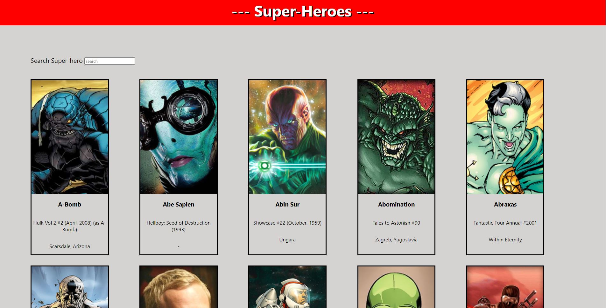

# AppAngular

Este proyecto usa la version 13.1.1 de [Angular CLI](https://github.com/angular/angular-cli)

## Development server

Escribe `ng serve`dentro del repositorio para empezar el servidor. Navega a `http://localhost:4200/`, donde estará la web.

## Información
Esta aplicación fue creada para dar un taller del uso de Angular, Typescript y realizar una petición con HTTP Client Module.

En el canal de [Microsoft Learn Student Ambasadors Latam](https://www.youtube.com/channel/UCmbg8KGKWJpiyn2OHyq2iBg)

## Demo

